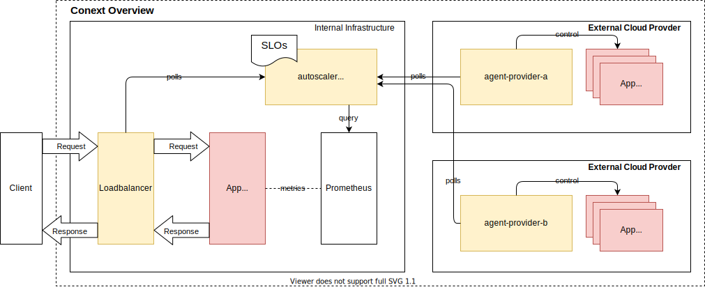

# Cloudburst

Prototype distributed architecture for an autoscaler for cloud bursting that operates within an organization and can provision and scale resources automatically based on metrics as container-as-a-service with a public cloud provider.

### Overview

Cloud bursting is an operating model in which an application is run in a private cloud environment or data center, but resources of a public cloud are automatically provisioned when the demand for computing capacity increases. Deciding which criteria to use to offload resources to a public cloud, how to integrate provisioned resources into the locally operated infrastructure, and which cloud provider service model to use has become the focus of current research in recent years. 

This "Hauptprojekt" conceptualizes, implements and evaluates an distributed architecture for an autoscaler for cloud bursting that operates within an organization and can provision and scale resources automatically based on metrics as container-as-a-service with a public cloud provider.

### Context

### Prerequisites

* Go 1.14+
* Docker (needed to generate OpenAPI spec and build containers)